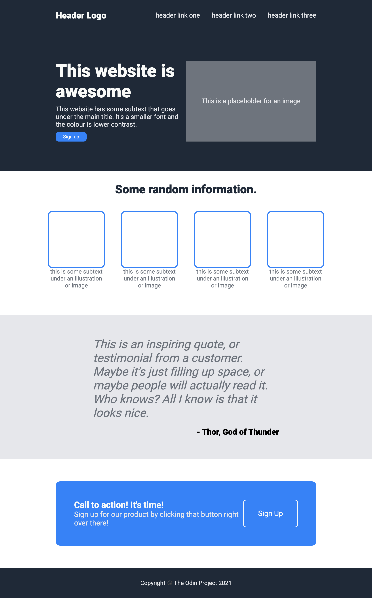

# TOP-Landing-Page
In this repository I will be creating a landing page from scratch using an image
provided by TheOdinProject. This is the final assignment for part 5 of the course
and will test my understanding of html, css and specifically flexbox.

Final Result:
